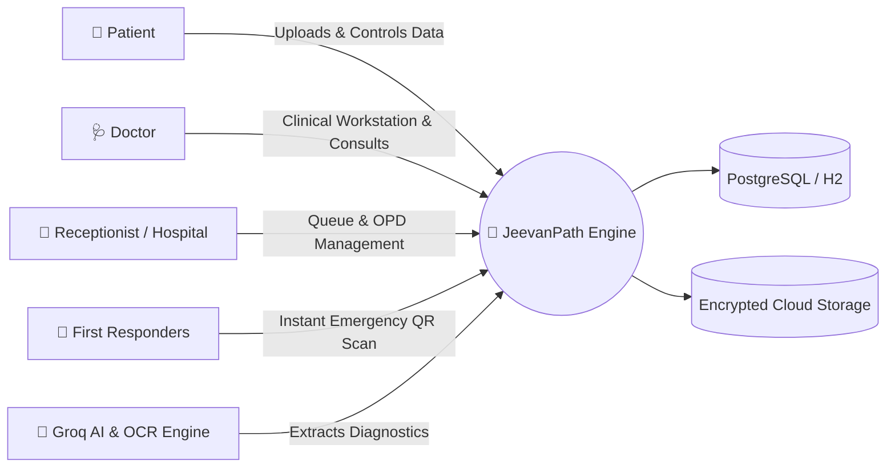
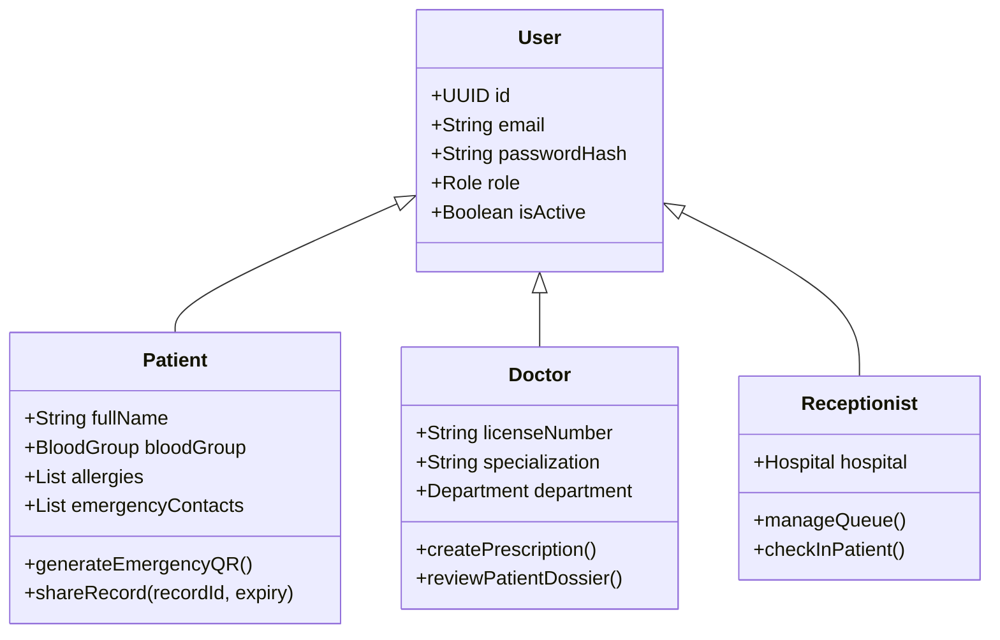

<div align="center">

# 🏥 JeevanPath (जीवनपथ)
### *Next-Generation Intelligent Digital Health Record & Healthcare Platform*

[](https://spring.io/projects/spring-boot)
[](https://www.oracle.com/java/)
[](https://react.dev/)
[](https://www.typescriptlang.org/)
[](https://vitejs.dev/)
[](https://www.postgresql.org/)
[](http://localhost:8085/swagger-ui/index.html)
[](LICENSE)

*Empowering patients with sovereign medical data ownership, intelligent clinical workflows, AI OCR document diagnostics, and zero-friction emergency triage.*

---

[Key Features](#-key-features) • [System Architecture](#-system-architecture) • [Live Demo & Quick Start](#-quick-start-guide) • [API Documentation](#-api--swagger-documentation) • [Security & RBAC](#-security--compliance) • [Directory Structure](#-directory-structure)

</div>

---

## 🌟 Executive Overview

**JeevanPath** is an enterprise-grade, full-stack digital health platform designed to unify fragmented healthcare records, eliminate dangerous diagnostic delays, and streamline clinical operations. 

Built with **Spring Boot 3 (Java 21)** and **React 19 (TypeScript + Vite)**, JeevanPath delivers an integrated ecosystem bridging patients, doctors, hospital receptionists, and emergency responders under a unified, role-based architecture.



---

## ✨ Key Features

### 1. 🪪 Sovereign Patient Vault & Consent-Driven Sharing
- **Encrypted Medical Document Storage**: Secure storage for lab reports, radiology imaging, discharge summaries, and prescriptions.
- **Time-Limited, Revocable Share Links**: Granular permission control granting healthcare providers access that automatically expires or can be revoked in real-time.
- **Digital Health Timeline**: Longitudinal aggregation of all past diagnoses, lab reports, and medication histories.

### 2. 🚨 Instant Emergency QR Triage System
- **Life-Saving Zero-Login Access**: Scannable QR code embedded on cards or lock-screens granting paramedics read-only access to critical vitals (Blood group, severe allergies, chronic conditions, emergency contacts).
- **Public Emergency View**: Fast, responsive emergency profile with instant one-tap dialing for designated emergency contacts.

### 3. 🤖 AI-Powered Prescription & Report Scanner
- **Optical Character Recognition (OCR)**: Extracts unstructured medical text from hand-written or printed prescriptions.
- **Groq AI Clinical Extraction**: Intelligently parses medications, dosages, frequency, and instructions into structured digital prescriptions and automated medicine reminders.

### 4. 🩺 Doctor Clinical Workstation & Queue Engine
- **Clinical Workstation**: Unified view with patient dossiers, historical vitals charts, previous encounters, and instant prescription generation.
- **Dynamic Slot & Queue Management**: Real-time token generation, OPD queue management, and live consultation status tracking.
- **Video Consultations**: Integrated teleconsultation modules and educational health video streaming.

### 5. 📊 Longitudinal Vitals Tracking & Early-Warning Risk Engine
- **Multi-Vital Analytics**: Interactive trend graphs for Blood Pressure, Blood Glucose, SpO2, Heart Rate, and BMI powered by Recharts.
- **Intelligent Risk Alerts**: Real-time threshold breach notifications and composite health score calculations.

### 6. 💳 Financial & National Healthcare Integration
- **Razorpay Payment Gateway**: Seamless end-to-end appointment consultation booking and fee settlement.
- **Government Schemes**: Integration support for Ayushman Bharat (PM-JAY), state health initiatives, and insurance eligibility checks.

---

## 🏛️ System Architecture

JeevanPath follows a **Clean Architecture / Modular Monolith** design pattern enforcing strict separation of concerns, unidirectional data flow, and immutable DTO mapping.

```mermaid
flowchart TD
    subgraph Client Layer
        A[React 19 + TypeScript SPA]
        B[Mobile Responsive Viewports]
        C[Emergency QR Scanner View]
    end

    subgraph Security & API Gateway
        D[JWT Authentication Filter]
        E[Role-Based Authorization Interceptor]
        F[CORS & Rate Limiting]
    end

    subgraph Service & Domain Layer
        G[Auth & User Domain]
        H[Patient Domain]
        I[Doctor & Hospital Domain]
        J[Appointment & Queue Engine]
        K[Medical Records & Prescription Engine]
        L[Emergency & Notification Service]
    end

    subgraph Data & Cloud Layer
        M[(PostgreSQL Database / H2)]
        N[Cloudinary Encrypted Storage]
        O[Groq AI OCR Endpoint]
        P[Razorpay Payment API]
    end

    Client Layer -->|HTTP / REST + Bearer JWT| Security & API Gateway
    Security & API Gateway --> Service & Domain Layer
    Service & Domain Layer --> Data & Cloud Layer
```

---

## 💻 Tech Stack

### 🎨 Frontend
- **Framework**: React 19.2 (with TypeScript 5.8)
- **Bundler & Tooling**: Vite 8.0, ESLint 9
- **Design System & Styling**: Custom CSS Design Tokens, Glassmorphism, Retro-Grid, Responsive Typography
- **Icons & Visuals**: Lucide React, Custom Medical Vector SVGs
- **Data Visualization**: Recharts 3.8
- **Network Client**: Axios with automated JWT interceptors and error unwrapping

### ⚙️ Backend
- **Runtime & Language**: Java 21 (LTS)
- **Framework**: Spring Boot 3.2.5
- **Security**: Spring Security 6 with Stateless JWT Authentication & BCrypt
- **Persistence**: Spring Data JPA, Hibernate 6.4 ORM
- **Database Migrations**: Flyway Versioned Migrations
- **Databases**: PostgreSQL (Production/Neon), H2 In-Memory (Local Development)
- **API Documentation**: Springdoc OpenAPI / Swagger UI 3
- **External Integrations**: Groq AI API, Cloudinary, Razorpay, JavaMailSender

---

## 🚀 Quick Start Guide

### 📋 Prerequisites
- **Java**: JDK 21 or higher installed (`java -version`)
- **Node.js**: v18.0 or higher (`node -v`)
- **Maven**: Maven 3.9+ (`mvn -v`)
- **Git**: Git installed

---

### 1️⃣ Clone the Repository
```bash
git clone https://github.com/rakshitp18/JeevanPath.git
cd JeevanPath/CareBridge
```

---

### 2️⃣ Running the Backend (Spring Boot)

The application includes an **in-memory H2 profile (`local`)** that starts instantly without needing a local PostgreSQL installation.

```bash
cd backend-spring

# Run with local H2 in-memory database
mvn spring-boot:run -Dspring-boot.run.profiles=local
```

> **Note**: To use remote cloud PostgreSQL (Neon), run:
> ```bash
> mvn spring-boot:run -Dspring-boot.run.profiles=neon
> ```

- **Backend Base URL**: `http://localhost:8085` (or configured port)
- **Swagger UI Interactive Docs**: `http://localhost:8085/swagger-ui/index.html`
- **H2 Database Web Console**: `http://localhost:8085/h2-console`
  - *JDBC URL*: `jdbc:h2:mem:medivault_dev`
  - *Username*: `sa`
  - *Password*: *(leave empty)*

---

### 3️⃣ Running the Frontend (React + Vite)

Open a new terminal window:

```bash
cd CareBridge/frontend

# Install dependencies
npm install

# Start the Vite development server
npm run dev
```

- **Frontend App**: `http://localhost:5173`

---

### 4️⃣ Running with Docker Compose 🐳

To launch both backend and frontend in containerized environments:

```bash
cd CareBridge
docker-compose up --build
```

---

## 📑 API & Swagger Documentation

JeevanPath provides comprehensive OpenAPI 3.0 documentation. Once the backend is running, navigate to:

🔗 **[http://localhost:8085/swagger-ui/index.html](http://localhost:8085/swagger-ui/index.html)**

### Core API Endpoint Groups

| Method | Endpoint | Description | Role |
| :--- | :--- | :--- | :--- |
| `POST` | `/api/v1/auth/register/patient` | Register new patient account | Public |
| `POST` | `/api/v1/auth/register/doctor` | Register doctor account with license info | Public |
| `POST` | `/api/v1/auth/login` | Authenticate and obtain JWT token | Public |
| `GET` | `/api/v1/patient/profile` | Retrieve normalized patient health profile | `PATIENT` |
| `POST` | `/api/v1/medical/records` | Upload medical document with metadata | `PATIENT` |
| `POST` | `/api/v1/medical/share` | Generate secure time-limited record share link | `PATIENT` |
| `GET` | `/api/v1/emergency/{token}` | Public emergency read-only vital access | Public / QR |
| `GET` | `/api/v1/doctor/appointments` | Doctor queue and scheduled encounters | `DOCTOR` |
| `POST` | `/api/v1/prescriptions` | Generate and dispatch digital prescription | `DOCTOR` |
| `POST` | `/api/v1/ai/ocr-extract` | Trigger Groq OCR prescription parsing | `PATIENT` / `DOCTOR` |

---

## 🔒 Security & Compliance

```
┌────────────────────────────────────────────────────────┐
│               Enterprise Security Matrix               │
├──────────────────────┬─────────────────────────────────┤
│ Password Protection  │ Adaptive BCrypt Hashing (Salt)  │
├──────────────────────┼─────────────────────────────────┤
│ Auth Architecture    │ Stateless Bearer JWT Tokens     │
├──────────────────────┼─────────────────────────────────┤
│ Authorization Level  │ Pre-Authorize Method Security   │
├──────────────────────┼─────────────────────────────────┤
│ Storage Privacy      │ Zero Raw Medical File Server DB │
├──────────────────────┼─────────────────────────────────┤
│ Emergency Access     │ Scoped Non-Login Masked Tokens  │
└──────────────────────┴─────────────────────────────────┘
```

- **Strict Entity Isolation**: Database entities are never directly exposed to HTTP controllers. All payloads are sanitized via DTOs and Mappers.
- **Granular RBAC**: Role-based access control filters validate user permissions on every request before executing business logic.
- **Safe Share Revocation**: Share links validate timestamps and cancellation status in real time to prevent unauthorized access.

---

## 📂 Directory Structure

```
JeevanPath/
├── CareBridge/
│   ├── backend-spring/              # Spring Boot 3 Java 21 Backend
│   │   ├── src/main/java/com/medivault/
│   │   │   ├── auth/                # JWT Auth, Register, Login
│   │   │   ├── common/              # BaseEntity, Response wrappers, Cloudinary
│   │   │   ├── config/              # Security, Swagger, CORS, WebSocket
│   │   │   ├── doctor/              # Doctor profiles, schedules, leaves
│   │   │   ├── medical/             # Records, prescriptions, OCR, reminders
│   │   │   ├── patient/             # Patient profiles, insurance, vitals
│   │   │   ├── platform/            # Emergency, schemes, notifications
│   │   │   └── security/            # JWT filters, UserPrincipal
│   │   ├── src/main/resources/      # application.yml, DB migrations
│   │   └── pom.xml                  # Maven configuration
│   │
│   ├── frontend/                    # React 19 + TypeScript Frontend
│   │   ├── src/
│   │   │   ├── components/          # Reusable UI & specialized modules
│   │   │   ├── pages/               # Dashboard, Appointments, AI Scanner, Landing
│   │   │   ├── services/            # Groq AI, Razorpay, Notification APIs
│   │   │   ├── styles/              # Design tokens and themes
│   │   │   ├── api.ts               # Axios client instance
│   │   │   └── App.tsx              # Router & layout shell
│   │   ├── package.json             # NPM dependencies
│   │   └── vite.config.ts           # Vite build configuration
│   │
│   ├── diagrams/                    # UML, ER, Sequence, and Use-case diagrams
│   └── docker-compose.yml           # Multi-container orchestration
└── README.md                        # Root Project Documentation
```

---

## 👥 User Roles & Personas



---

## 🤝 Contributing

Contributions are welcome! Please follow these steps:

1. **Fork the Repository**
2. **Create a Feature Branch** (`git checkout -b feature/AmazingFeature`)
3. **Commit Your Changes** (`git commit -m 'feat: add amazing new feature'`)
4. **Push to Branch** (`git push origin feature/AmazingFeature`)
5. **Open a Pull Request**

---

## 📜 License

Distributed under the **MIT License**. See `LICENSE` for more information.

<div align="center">

**Built with ❤️ for resilient and accessible healthcare worldwide.**

</div>
